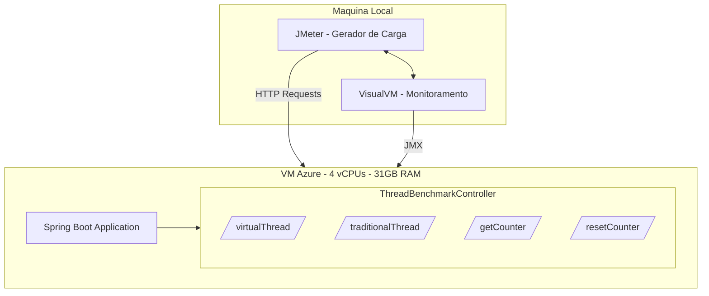

# 📚 TCC - Trabalho de Conclusão de Curso

> **Análise de Desempenho em Java: Threads Tradicionais vs. Threads Virtuais**  
> **Autora:** Stephanye Cristine Antunes De Cunto  
> **Orientadora:** Me. Bianca Portes de Castro  
> **Coorientador:** Dr. José Rui Castro de Sousa  
> **Ano:** 2025

[](https://www.oracle.com/java/)
[](https://spring.io/projects/spring-boot)
[](https://www.abntex.net.br/)
[]()
[](https://wakatime.com/badge/user/5a343522-23db-45ae-b20b-54655c392390/project/221c0cf4-099d-4775-8ef9-bb8e514e04b0)

---

## 📑 Sumário

- [📋 Sobre o Projeto](#-sobre-o-projeto)
- [☁️ Sincronização Automática com Google Drive](#️-sincronização-automática-com-google-drive)
  - [🎯 Como Funciona](#-como-funciona)
  - [🚀 Configuração Inicial](#-configuração-inicial)
  - [🧪 Testando a Configuração](#-testando-a-configuração)
  - [📊 Comandos Úteis do Rclone](#-comandos-úteis-do-rclone)
  - [⚙️ Opções Avançadas](#️-opções-avançadas)
  - [🔧 Solução de Problemas](#-solução-de-problemas)
  - [📱 Sincronização em Múltiplas Máquinas](#-sincronização-em-múltiplas-máquinas)
  - [🎓 Dicas de Uso](#-dicas-de-uso)
  - [🚀 Workflow Completo](#-workflow-completo)
- [🏗️ Arquitetura do Projeto](#️-arquitetura-do-projeto)
- [📁 Estrutura do Repositório](#-estrutura-do-repositório)
- [🚀 Como Começar](#-como-começar)
- [🔧 Configuração das Ferramentas](#-configuração-das-ferramentas)
  - [JMeter - Testes de Carga](#jmeter---testes-de-carga)
  - [VisualVM - Monitoramento em Tempo Real](#visualvm---monitoramento-em-tempo-real)
- [📊 API de Benchmark](#-api-de-benchmark)
- [📦 Pré-requisitos](#-pré-requisitos)
- [📝 Compilando o Documento](#-compilando-o-documento)
- [📚 Gerenciando Referências](#-gerenciando-referências)
- [🛠️ Ferramentas Recomendadas](#️-ferramentas-recomendadas)
- [🧪 Metodologia de Testes](#-metodologia-de-testes)
- [📖 Materiais de Referência no Repositório](#-materiais-de-referência-no-repositório)
- [🐛 Problemas Comuns](#-problemas-comuns)
- [📚 Recursos Úteis](#-recursos-úteis)
- [📋 Checklist de Progresso](#-checklist-de-progresso)
- [🎯 Próximos Passos](#-próximos-passos)
- [📧 Contato](#-contato)
- [📄 Licença](#-licença)

---

## 📋 Sobre o Projeto

Este repositório contém o desenvolvimento do Trabalho de Conclusão de Curso (TCC), que investiga as diferenças de desempenho entre **threads tradicionais** (gerenciadas pelo sistema operacional) e **threads virtuais** (gerenciadas pela JVM, introduzidas no Java 19).

### 🎯 Objetivos

- Comparar o desempenho entre threads tradicionais e virtuais em diferentes cenários
- Analisar o consumo de recursos (CPU, memória, I/O)
- Avaliar a escalabilidade sob diferentes cargas de trabalho
- Medir latência e throughput em aplicações web

### 📊 Status Atual

- ✅ Revisão bibliográfica em andamento
- ✅ Ambiente de desenvolvimento configurado (VM Azure)
- ✅ Servidor de benchmark implementado (Spring Boot)
- 🔄 Definição da metodologia em andamento
- 🔄 Configuração de ferramentas de teste (JMeter, VisualVM)
- ⏳ Implementação dos benchmarks (em andamento)
- ⏳ Coleta de dados (pendente)
- ⏳ Análise de resultados (pendente)

---

## ☁️ Sincronização Automática com Google Drive

Este repositório está configurado para sincronizar automaticamente com o Google Drive usando **Rclone** após cada commit, mantendo um backup sempre atualizado do seu TCC.

### 🎯 Como Funciona


Sempre que você executar `git commit`, o Rclone sincroniza automaticamente a pasta do projeto com o Google Drive, excluindo arquivos temporários e desnecessários.

---

### 🚀 Configuração Inicial

#### 1️⃣ Instalar o Rclone

**Linux/macOS:**
```bash
curl https://rclone.org/install.sh | sudo bash
```

**Windows:**
```powershell
# Via Chocolatey
choco install rclone

# Ou baixe em: https://rclone.org/downloads/
```

#### 2️⃣ Configurar Google Drive

```bash
# Iniciar configuração
rclone config

# Siga os passos:
# n) New remote
# name> drive
# Storage> drive (Google Drive)
# client_id> (deixe em branco e pressione Enter)
# client_secret> (deixe em branco e pressione Enter)
# scope> 1 (Full access)
# Configure a auto config? y
# (Uma janela do navegador abrirá para autorização)
```

#### 3️⃣ Criar o Hook Git

```bash
cd tcc/.git/hooks

# Criar arquivo post-commit
cat > post-commit << 'EOF'
#!/bin/bash

# 🎨 Cores para output
GREEN='\033[0;32m'
BLUE='\033[0;34m'
NC='\033[0m' # No Color

echo -e "${BLUE}🔄 Sincronizando com Google Drive...${NC}"

# Sincronizar com Drive
rclone sync ../ drive:/tcc \
  --filter-from ../filters.txt \
  --progress \
  --log-level INFO

if [ $? -eq 0 ]; then
    echo -e "${GREEN}✅ Sincronização concluída com sucesso!${NC}"
else
    echo -e "⚠️  Erro na sincronização. Verifique a configuração do Rclone."
fi
EOF

# Tornar executável
chmod +x post-commit
```

#### 4️⃣ Criar Arquivo de Filtros

Crie o arquivo `filters.txt` na raiz do projeto:

```bash
cd tcc
cat > filters.txt << 'EOF'
# ═══════════════════════════════════════════════════════
# 🚫 ARQUIVOS EXCLUÍDOS DA SINCRONIZAÇÃO
# ═══════════════════════════════════════════════════════

# ─── LaTeX Temporários ───
- *.aux
- *.bbl
- *.blg
- *.idx
- *.lof
- *.log
- *.loq
- *.lot
- *.toc
- *.out
- *.fdb_latexmk
- *.fls
- *.synctex.gz
- *.ilg
- *.ind

# ─── Sistema ───
- .DS_Store
- Thumbs.db
- desktop.ini

# ─── Build/Target ───
- target/
- */target/
- build/
- */build/

# ─── Git ───
- .git/
- .github/
- .gitignore

# ─── IDEs ───
- .idea/
- .vscode/
- *.iml

# ─── Logs ───
- *.log
- logs/

# ═══════════════════════════════════════════════════════
# ✅ INCLUIR EXPLICITAMENTE (opcional)
# ═══════════════════════════════════════════════════════
# + Modelo_TCC_2025/principal.pdf
# + Test/Serve_Test/benchmark-server/
EOF
```

---

### 🧪 Testando a Configuração

#### Teste Simples

```bash
# Fazer commit vazio para testar
git commit --allow-empty -m "🧪 Teste sincronização Rclone"

# Você verá:
# 🔄 Sincronizando com Google Drive...
# Transferred:   	    1.234 MiB / 1.234 MiB, 100%, 2.456 MiB/s, ETA 0s
# ✅ Sincronização concluída com sucesso!
```

#### Verificar no Google Drive

```bash
# Listar arquivos no Drive
rclone ls drive:/tcc

# Ver estrutura de pastas
rclone tree drive:/tcc
```

---

### 📊 Comandos Úteis do Rclone

| Comando | Descrição |
|---------|-----------|
| `rclone sync` | Sincroniza origem → destino (exclui arquivos no destino que não existem na origem) |
| `rclone copy` | Copia arquivos sem excluir do destino |
| `rclone ls drive:/tcc` | Lista todos os arquivos |
| `rclone tree drive:/tcc` | Mostra estrutura de diretórios |
| `rclone size drive:/tcc` | Mostra espaço usado |
| `rclone check ./ drive:/tcc` | Verifica diferenças entre local e remoto |

#### Sincronização Manual (quando necessário)

```bash
# Sincronizar manualmente
rclone sync ./ drive:/tcc --filter-from ./filters.txt --progress

# Fazer backup completo (sem excluir nada no destino)
rclone copy ./ drive:/tcc-backup --progress

# Sincronização bidirecional (cuidado!)
rclone bisync ./ drive:/tcc --resync --filter-from ./filters.txt
```

---

### ⚙️ Opções Avançadas

#### Hook Mais Completo (com notificações e logs)

```bash
#!/bin/bash

# ═══════════════════════════════════════════════════════
# 🎯 HOOK POST-COMMIT - SYNC COM GOOGLE DRIVE
# ═══════════════════════════════════════════════════════

# Cores
GREEN='\033[0;32m'
BLUE='\033[0;34m'
YELLOW='\033[1;33m'
RED='\033[0;31m'
NC='\033[0m'

# Configurações
DRIVE_PATH="drive:/tcc"
LOG_FILE="../.rclone-sync.log"
FILTER_FILE="../filters.txt"

# Timestamp
TIMESTAMP=$(date '+%Y-%m-%d %H:%M:%S')

echo -e "${BLUE}╔════════════════════════════════════════╗${NC}"
echo -e "${BLUE}║  🔄 Sincronizando com Google Drive    ║${NC}"
echo -e "${BLUE}╚════════════════════════════════════════╝${NC}"

# Sincronizar
rclone sync ../ "$DRIVE_PATH" \
  --filter-from "$FILTER_FILE" \
  --log-file "$LOG_FILE" \
  --log-level INFO \
  --stats 1s \
  --stats-one-line

# Verificar resultado
if [ $? -eq 0 ]; then
    echo -e "${GREEN}✅ Sincronização concluída!${NC}"
    echo "[$TIMESTAMP] ✅ Sync successful" >> "$LOG_FILE"
    
    # Estatísticas
    SIZE=$(rclone size "$DRIVE_PATH" --json | jq -r '.bytes' | numfmt --to=iec)
    echo -e "${YELLOW}📊 Tamanho total no Drive: $SIZE${NC}"
else
    echo -e "${RED}⚠️  Erro na sincronização!${NC}"
    echo "[$TIMESTAMP] ❌ Sync failed" >> "$LOG_FILE"
    exit 1
fi

echo ""
```

#### Adicionar ao `.gitignore`

```bash
# Adicionar ao .gitignore do projeto
echo ".rclone-sync.log" >> .gitignore
echo "filters.txt" >> .gitignore
```

---

### 🔧 Solução de Problemas

| Problema | Solução |
|----------|---------|
| **Hook não executa** | Verifique permissões: `chmod +x .git/hooks/post-commit` |
| **Rclone não encontrado** | Use caminho completo: `/usr/local/bin/rclone` |
| **Erro de autenticação** | Reconfigure: `rclone config reconnect drive:` |
| **Sync muito lento** | Adicione `--transfers 8` para paralelismo |
| **Muitos arquivos ignorados** | Revise `filters.txt` |

#### Logs Detalhados

```bash
# Ver últimos syncs
tail -50 .rclone-sync.log

# Monitorar em tempo real
tail -f .rclone-sync.log

# Sync manual com debug
rclone sync ./ drive:/tcc --filter-from ./filters.txt -vv
```

---

### 📱 Sincronização em Múltiplas Máquinas

Se você trabalha em várias máquinas, configure o hook em todas:

```bash
# Máquina 1
git clone <seu-repo>
cd tcc
# Configure rclone e hook (passos acima)

# Máquina 2
git clone <seu-repo>
cd tcc
# Configure rclone (pode usar o mesmo remote "drive")
# Configure hook (mesmos passos)
```

**⚠️ Importante:** O `rclone sync` é unidirecional (local → Drive). Se quiser sincronização bidirecional, use:

```bash
rclone bisync ./ drive:/tcc --resync --filter-from ./filters.txt
```

---

### 🎓 Dicas de Uso

✅ **Faça commits frequentes** - A sincronização automática só ocorre após commits  
✅ **Revise filters.txt** - Evite enviar arquivos temporários desnecessários  
✅ **Verifique espaço no Drive** - Use `rclone size drive:/tcc`  
✅ **Mantenha backups** - O Drive não é versionado; use Git + Drive juntos  
✅ **Teste antes de defender** - Verifique se o PDF está atualizado no Drive

---

### 🚀 Workflow Completo

```bash
# 1. Trabalhar no documento
cd Modelo_TCC_2025
# ... editar principal.tex ...

# 2. Compilar
latexmk -lualatex principal.tex

# 3. Commitar
git add .
git commit -m "📝 Atualizar seção de metodologia"
# 🔄 Sincronização automática com Drive acontece aqui!

# 4. Push para GitHub
git push origin main

# 5. Verificar no Drive (opcional)
rclone ls drive:/tcc/Modelo_TCC_2025/principal.pdf
```

---

## 🏗️ Arquitetura do Projeto

### Ambiente de Execução




---

## 📁 Estrutura do Repositório

```
tcc/
├── Modelo_TCC_2025/              # 📄 Documento principal (LaTeX)
│   ├── principal.tex             # Arquivo principal do TCC
│   ├── principal.pdf             # PDF compilado
│   ├── imagens/                  # Figuras e diagramas
│   │   └── Figura 1.png
│   ├── abntex2*.{cls,sty,bst}    # Classes e estilos ABNT
│   └── abntex2-modelo-references.bib  # Referências bibliográficas
│
├── Test/Serve_Test/              # 🚀 Aplicação de Benchmark
│   └── benchmark-server/         # Servidor Spring Boot
│       ├── pom.xml               # Dependências Maven
│       └── src/
│           └── main/java/com/benchmark/server/
│               ├── BenchmarkServerApplication.java
│               └── controller/
│                   └── ThreadBenchmarkController.java
│
├── Teste_JMH/                    # 🔬 Testes e experimentos com JMH
│   ├── jmh-*.tex                 # Documentação sobre JMH
│   └── test/                     # Projeto Maven de exemplo
│       ├── pom.xml
│       └── src/main/java/org/sample/
│           ├── BlackholePipelineBench.java
│           └── TesteProfiler.java
│
├── Coletar_Metricas/             # 📈 Guias de monitoramento
│   ├── coletarMetricasLinux.tex  # mpstat, vmstat, iostat
│   └── MetricasJMH.tex           # Métricas do JMH
│
├── VM/                           # ☁️ Documentação do ambiente
│   ├── Vm Java Quickstart.pdf
│   └── especificacoes_vm_azure_detalhado.pdf
│
├── Quadro_Trabalhos_Relacionados/  # 📊 Trabalhos relacionados
│   └── quadro.tex                # Comparativo de estudos similares
│
├── Proposta_TCC/                 # 📝 Proposta inicial
│   └── main.tex
│
├── Proposta_Teste/               # 🧪 Testes de proposta
│   └── TrabalhosRelacionadosTeste.tex
│
├── Resumo_Trabalhos_Relaionados/ # 📌 Resumos
│   ├── resumo.tex
│   └── resumo2.tex
│
├── filters.txt                   # 🚫 Regras de exclusão Rclone
├── .rclone-sync.log             # 📝 Log de sincronizações
├── .gitignore
└── README.md
```

---

## 🚀 Como Começar

### 1. Clone o Repositório

```bash
git clone https://github.com/StephanyeCunto/tcc
cd tcc
```

### 2. Configuração do Ambiente

#### Servidor de Benchmark (VM Azure)

```bash
cd Test/Serve_Test/benchmark-server

# Compilar o projeto
mvn clean package

# Executar o servidor
java -jar target/benchmark-server-0.0.1-SNAPSHOT.jar
```

O servidor estará disponível em: `http://<IP_DA_VM>:8080`

#### Ferramentas de Teste (Máquina Local)

**JMeter:**
```bash
# Download
wget https://dlcdn.apache.org//jmeter/binaries/apache-jmeter-5.6.3.tgz
tar -xzf apache-jmeter-5.6.3.tgz
cd apache-jmeter-5.6.3/bin

# Executar interface gráfica
./jmeter
```

**VisualVM:**
```bash
# Linux/macOS
brew install visualvm  # ou baixe de https://visualvm.github.io/

# Conectar à VM via JMX
# Adicione ao servidor: -Dcom.sun.management.jmxremote.port=9090
```

### 3. Compilação do Documento LaTeX

```bash
cd Modelo_TCC_2025
latexmk -lualatex -pvc principal.tex
```

---

## 🔧 Configuração das Ferramentas

### JMeter - Testes de Carga

#### Criando um Plano de Teste

1. **Thread Group:**
   - Number of Threads: 100, 500, 1000, 5000
   - Ramp-Up Period: 60 segundos
   - Loop Count: 10

2. **HTTP Request Sampler:**
   ```
   Server: <IP_DA_VM>
   Port: 8080
   Path: /virtualThread  ou  /traditionalThread
   Method: GET
   ```

3. **Listeners para Coleta:**
   - View Results Tree
   - Summary Report
   - Aggregate Report
   - Response Time Graph

#### Cenários de Teste

| Cenário | Threads | Ramp-Up | Duração | Objetivo |
|---------|---------|---------|---------|----------|
| Carga Baixa | 100 | 10s | 5min | Baseline |
| Carga Média | 500 | 30s | 10min | Operação normal |
| Carga Alta | 1000 | 60s | 15min | Estresse |
| Carga Extrema | 5000 | 120s | 20min | Limite |

#### Exemplo de Script CLI

```bash
# Executar teste via linha de comando
jmeter -n -t plano_teste.jmx \
       -l resultados.jtl \
       -e -o relatorio_html/
```

---

### VisualVM - Monitoramento em Tempo Real

#### Configurando a Conexão JMX

**No servidor (VM Azure):**

```bash
# Adicionar ao script de execução
java -Dcom.sun.management.jmxremote \
     -Dcom.sun.management.jmxremote.port=9090 \
     -Dcom.sun.management.jmxremote.authenticate=false \
     -Dcom.sun.management.jmxremote.ssl=false \
     -Djava.rmi.server.hostname=<IP_DA_VM> \
     -jar benchmark-server.jar
```

**No VisualVM (máquina local):**

1. File → Add JMX Connection
2. Connection: `<IP_DA_VM>:9090`
3. Desmarcar "Require SSL connection"
4. OK

#### Métricas Monitoradas

| Métrica | Descrição | Relevância |
|---------|-----------|------------|
| **CPU Usage** | % de uso da CPU | Threads virtuais devem usar menos CPU |
| **Heap Memory** | Memória heap usada/total | Threads virtuais consomem menos memória |
| **Threads** | Número de threads ativas | Threads virtuais escaláveis |
| **GC Activity** | Atividade do Garbage Collector | Impacto na latência |

#### Plugins Recomendados

- **Visual GC:** Monitoramento detalhado do GC
- **Tracer:** Rastreamento de métodos
- **Threads:** Análise de deadlocks e contenção

---

## 📊 API de Benchmark

### Endpoints Disponíveis

#### 1. Thread Virtual

```http
GET /virtualThread
```

**Resposta:**
```json
"Thread virtual iniciada! Veja o console do servidor."
```

**Comportamento:**
- Cria uma thread virtual usando `Thread.ofVirtual()`
- Executa tarefa que dorme por 1 segundo
- Incrementa contador
- Aguarda conclusão com `join()`

---

#### 2. Thread Tradicional

```http
GET /traditionalThread
```

**Resposta:**
```json
"Thread iniciada! Veja o console do servidor."
```

**Comportamento:**
- Cria uma thread tradicional usando `new Thread()`
- Executa mesma tarefa (sleep 1s)
- Incrementa contador
- Aguarda conclusão com `join()`

---

#### 3. Obter Contador

```http
GET /getCounter
```

**Resposta:**
```json
42
```

Retorna o número total de threads executadas desde o último reset.

---

#### 4. Resetar Contador

```http
DELETE /resetCounter
```

**Resposta:**
```json
42
```

Reseta o contador para 0 e retorna o valor anterior.

---

### Exemplos de Uso

#### cURL

```bash
# Testar thread virtual
curl http://localhost:8080/virtualThread

# Testar thread tradicional
curl http://localhost:8080/traditionalThread

# Ver contador
curl http://localhost:8080/getCounter

# Resetar contador
curl -X DELETE http://localhost:8080/resetCounter
```

#### Python

```python
import requests

BASE_URL = "http://localhost:8080"

# Executar 100 requisições virtuais
for i in range(100):
    response = requests.get(f"{BASE_URL}/virtualThread")
    print(f"Requisição {i+1}: {response.status_code}")

# Obter total
counter = requests.get(f"{BASE_URL}/getCounter").json()
print(f"Total de threads executadas: {counter}")
```

---

## 📦 Pré-requisitos

### Para o Servidor (VM Azure)

- **Java:** 19+ (com suporte a Virtual Threads)
- **Maven:** 3.8+
- **Spring Boot:** 3.x
- **Sistema:** Linux (Ubuntu/Debian recomendado)

**Instalação no Ubuntu:**

```bash
# Java 21 (LTS com Virtual Threads)
sudo apt update
sudo apt install openjdk-21-jdk

# Maven
sudo apt install maven

# Ferramentas de monitoramento
sudo apt install sysstat  # mpstat, iostat, vmstat
```

---

### Para Cliente de Testes (Máquina Local)

**JMeter:**
- Java 8+ (para executar o JMeter)
- Download: https://jmeter.apache.org/download_jmeter.cgi

**VisualVM:**
- Java 8+ (JDK recomendado para JMX)
- Download: https://visualvm.github.io/

**Linux (Ubuntu/Debian):**
```bash
sudo apt install openjdk-21-jdk
sudo apt install visualvm
```

**macOS:**
```bash
brew install openjdk@21
brew install visualvm
brew install jmeter
```

**Windows:**
- Java: https://www.oracle.com/java/technologies/downloads/
- VisualVM: https://visualvm.github.io/
- JMeter: https://jmeter.apache.org/

---

### Para LaTeX

**Linux (Ubuntu/Debian):**
```bash
sudo apt-get update
sudo apt-get install texlive-full latexmk biber
```

**macOS:**
```bash
brew install --cask mactex
```

**Windows:**
- [MiKTeX](https://miktex.org/download) ou [TeX Live](https://www.tug.org/texlive/)
- Ou use [Overleaf](https://www.overleaf.com/) (editor online)

---

## 📝 Compilando o Documento

### Método 1: Compilação Automática (Recomendado)

```bash
cd Modelo_TCC_2025
latexmk -lualatex -pvc principal.tex
```

**Flags úteis:**
- `-pvc`: Recompila automaticamente ao salvar
- `-lualatex`: Usa LuaLaTeX (melhor suporte a UTF-8 e português)

### Método 2: Compilação Manual Completa

Para garantir que referências e citações sejam processadas corretamente:

```bash
cd Modelo_TCC_2025

# 1ª compilação - Gera arquivos auxiliares
lualatex principal.tex

# Processa referências bibliográficas
bibtex principal

# 2ª compilação - Inclui referências
lualatex principal.tex

# 3ª compilação - Ajusta referências cruzadas
lualatex principal.tex
```

### Método 3: Usando latexmk Simplificado

```bash
cd Modelo_TCC_2025
latexmk -lualatex -bibtex principal.tex
```

💡 O arquivo `principal.pdf` será gerado automaticamente.

### Limpeza de Arquivos Temporários

```bash
# Remove arquivos auxiliares (mantém PDF)
latexmk -c

# Remove TODOS os arquivos gerados (inclusive PDF)
latexmk -C
```

---

## 📚 Gerenciando Referências

### Arquivo de Bibliografia

As referências ficam em `abntex2-modelo-references.bib`. 

**Exemplos de diferentes tipos de entrada:**

**Artigo:**
```bibtex
@article{sobrenome2025,
  author  = {Nome Sobrenome},
  title   = {Título do Artigo},
  journal = {Nome da Revista},
  year    = {2025},
  volume  = {1},
  number  = {1},
  pages   = {1--10}
}
```

**Livro:**
```bibtex
@book{autor2024,
  author    = {Autor da Silva},
  title     = {Título do Livro},
  publisher = {Editora},
  year      = {2024},
  address   = {São Paulo}
}
```

**Site:**
```bibtex
@online{site2025,
  author = {Organização},
  title  = {Título da Página},
  year   = {2025},
  url    = {https://exemplo.com},
  urlaccessdate = {05 nov. 2025}
}
```

### Citando no Texto

**Citação direta (Autor faz parte da frase):**
```latex
Segundo \citeonline{sobrenome2025}, os resultados demonstram...
```
→ *Segundo Sobrenome (2025), os resultados demonstram...*

**Citação indireta (Autor entre parênteses):**
```latex
Os resultados demonstram \cite{sobrenome2025}...
```
→ *Os resultados demonstram (SOBRENOME, 2025)...*

**Múltiplas citações:**
```latex
Diversos autores concordam \cite{autor2024,sobrenome2025,site2025}.
```
---

## 🛠️ Ferramentas Recomendadas

### Editores LaTeX

| Editor | Vantagens |
|--------|-----------|
| **[VS Code](https://code.visualstudio.com/)** + [LaTeX Workshop](https://marketplace.visualstudio.com/items?itemName=James-Yu.latex-workshop) | Leve, moderno, Git integrado |
| **[TeXstudio](https://www.texstudio.org/)** | Específico para LaTeX, muitos recursos |
| **[Overleaf](https://www.overleaf.com/)** | Online, colaborativo, sem instalação |

---

## 🧪 Metodologia de Testes

### Fluxo de Experimentos

```
1. Preparação
   ├─ Configurar VM Azure
   ├─ Deploy do servidor
   └─ Validar conectividade

2. Baseline
   ├─ Coletar métricas sem carga
   └─ Verificar estado inicial

3. Testes de Carga (JMeter)
   ├─ Cenário 1: 100 threads (5min)
   ├─ Cenário 2: 500 threads (10min)
   ├─ Cenário 3: 1000 threads (15min)
   └─ Cenário 4: 5000 threads (20min)

4. Monitoramento (VisualVM + Scripts)
   ├─ Coleta em tempo real
   └─ Logs do sistema

5. Análise
   ├─ Processar dados
   ├─ Gerar gráficos
   └─ Análise estatística
```

### Variáveis Mensuradas

| Variável | Ferramenta | Unidade |
|----------|-----------|---------|
| **Throughput** | JMeter | req/s |
| **Latência** | JMeter | ms |
| **CPU** | VisualVM | % |
| **Memória Heap** | VisualVM | MB |
| **Threads Ativas** | VisualVM | count |
| **GC Pause** | VisualVM | ms |

---

## 📖 Materiais de Referência no Repositório

### Documentação Incluída

| Arquivo | Descrição |
|---------|-----------|
| **`jmh-*.pdf`** | Guias sobre Java Microbenchmark Harness (JMH) |
| **`coletarMetricasLinux.pdf`** | Ferramentas: mpstat, vmstat, iostat |
| **`MetricasJMH.pdf`** | Métricas e análise de benchmarks JMH |
| **`quadro.pdf`** | Comparativo de trabalhos relacionados |
| **`especificacoes_vm_azure_detalhado.pdf`** | Detalhes da VM Azure (4 vCPUs, 31 GB RAM) |

---

## 🐛 Problemas Comuns

### LaTeX

| Problema | Solução |
|----------|---------|
| **Referências não aparecem** | Execute: `lualatex → bibtex → lualatex → lualatex` |
| **Acentos incorretos** | Use LuaLaTeX ao invés de pdfLaTeX |
| **Erro em imagens** | Verifique o caminho e se o arquivo existe em `imagens/` |
| **Undefined control sequence** | Verifique se todos os pacotes necessários estão instalados |
| **Compilação muito lenta** | Use `latexmk -c` para limpar arquivos temporários |

### Servidor e Testes

| Problema | Solução |
|----------|---------|
| **Servidor não inicia** | Verifique se a porta 8080 está livre: `lsof -i :8080` |
| **JMeter não conecta** | Confirme IP da VM e firewall (porta 8080 aberta) |
| **VisualVM não conecta** | Verifique configuração JMX e porta 9090 |
| **Métricas não coletadas** | Execute scripts com `sudo` e instale `sysstat` |
| **OutOfMemoryError** | Aumente heap: `-Xmx4g -Xms2g` |

---

# 📚 Recursos Úteis

## LaTeX e ABNT
- [📘 Documentação abntex2](https://www.abntex.net.br/) - Guia oficial do padrão ABNT para LaTeX
- [📖 Overleaf Learn LaTeX](https://www.overleaf.com/learn) - Tutoriais interativos e exemplos práticos
- [📚 LaTeX Wikibook](https://en.wikibooks.org/wiki/LaTeX) - Referência completa da linguagem

---

## Java e Concorrência
- [📄 JEP 444: Virtual Threads](https://openjdk.org/jeps/444) - Especificação oficial das Virtual Threads
- [🔬 JMH Samples](https://hg.openjdk.org/code-tools/jmh/file/tip/jmh-samples/) - Exemplos práticos de benchmarks
- [📕 Java Concurrency in Practice](https://jcip.net/) - Livro referência sobre concorrência
- [🧵 Project Loom](https://openjdk.org/projects/loom/) - Projeto que introduziu Virtual Threads
- [📚 Java Documentation](https://docs.oracle.com/en/java/) - Documentação oficial da Oracle
- [🎓 Baeldung Java](https://www.baeldung.com/) - Tutoriais e guias sobre Java

---

## Ferramentas de Teste e Monitoramento
- [⚡ JMeter User Manual](https://jmeter.apache.org/usermanual/index.html) - Documentação completa do JMeter
- [📊 VisualVM Documentation](https://visualvm.github.io/documentation.html) - Guia de monitoramento e profiling
- [🌱 Spring Boot Reference](https://docs.spring.io/spring-boot/docs/current/reference/html/) - Documentação do Spring Boot
- [🔧 Maven Documentation](https://maven.apache.org/guides/) - Guias de build e gerenciamento de dependências

---

## Sincronização e Backup
- [📘 Rclone Documentation](https://rclone.org/docs/) - Documentação oficial do Rclone
- [☁️ Google Drive with Rclone](https://rclone.org/drive/) - Guia específico para Google Drive
- [🎯 Rclone Filtering](https://rclone.org/filtering/) - Como filtrar arquivos na sincronização
- [🔄 Rclone Commands](https://rclone.org/commands/) - Referência completa de comandos

---

## Controle de Versão
- [🐙 Git Documentation](https://git-scm.com/doc) - Documentação oficial do Git
- [🪝 Git Hooks Documentation](https://git-scm.com/docs/githooks) - Guia sobre hooks do Git
- [📖 Pro Git Book](https://git-scm.com/book/en/v2) - Livro gratuito sobre Git
- [🎓 GitHub Guides](https://guides.github.com/) - Tutoriais do GitHub

---

## Comunidades e Fóruns
- [💬 Stack Overflow - LaTeX](https://tex.stackexchange.com/) - Perguntas e respostas sobre LaTeX
- [💬 Stack Overflow - Java](https://stackoverflow.com/questions/tagged/java) - Comunidade Java
- [🤖 Reddit - r/LaTeX](https://www.reddit.com/r/LaTeX/) - Discussões sobre LaTeX
- [☕ Reddit - r/java](https://www.reddit.com/r/java/) - Comunidade Java no Reddit
- [🌐 Dev.to - Java](https://dev.to/t/java) - Artigos e tutoriais sobre Java

---

## Azure e Cloud
- [☁️ Azure Documentation](https://docs.microsoft.com/azure/) - Documentação completa do Azure
- [🖥️ Azure Virtual Machines](https://docs.microsoft.com/azure/virtual-machines/) - Guia de VMs no Azure
- [🔐 Azure Security](https://docs.microsoft.com/azure/security/) - Boas práticas de segurança

---

**📌 Última atualização:** Novembro de 2025
---

## 📋 Checklist de Progresso

### Documentação
- [x] README configurado
- [x] Estrutura organizada
- [x] Materiais de referência
- [ ] Metodologia definida
- [ ] Seção de resultados preparada

### Ambiente
- [x] VM Azure configurada
- [x] Servidor implementado
- [ ] JMeter configurado
- [ ] VisualVM configurado
- [ ] Scripts de coleta testados

### Implementação
- [x] Controller básico
- [ ] Endpoints de benchmark
- [ ] Diferentes cenários de carga
- [ ] Logging estruturado
- [ ] Coleta automática de métricas

### Testes
- [ ] Planos de teste JMeter criados
- [ ] Testes de baseline
- [ ] Testes de carga baixa (100 threads)
- [ ] Testes de carga média (500 threads)
- [ ] Testes de carga alta (1000 threads)
- [ ] Testes de carga extrema (5000 threads)

### Análise
- [ ] Dados coletados
- [ ] Processamento de dados
- [ ] Gráficos gerados
- [ ] Análise estatística
- [ ] Conclusões preliminares

### Escrita
- [ ] Introdução
- [ ] Revisão bibliográfica
- [ ] Metodologia
- [ ] Resultados
- [ ] Discussão
- [ ] Conclusão

---

## 🎯 Próximos Passos

1. **Semana 1-2:**
   - [ ] Finalizar configuração do JMeter
   - [ ] Criar planos de teste para todos os cenários
   - [ ] Testar conexão VisualVM com a VM

2. **Semana 3-4:**
   - [ ] Executar testes de baseline
   - [ ] Executar testes com cargas incrementais
   - [ ] Coletar todas as métricas

3. **Semana 5-6:**
   - [ ] Processar e analisar dados
   - [ ] Gerar gráficos e tabelas
   - [ ] Escrever seção de resultados

4. **Semana 7-8:**
   - [ ] Revisar todo o documento
   - [ ] Preparar apresentação
   - [ ] Ajustes finais

---

## 📧 Contato

**Stephanye Cristine Antunes De Cunto**

Para dúvidas sobre o projeto ou colaborações, entre em contato através do GitHub.

---

## 📄 Licença

Este trabalho é de natureza acadêmica e está disponível para fins educacionais.

⚠️ **Nota sobre Plágio:** Este material é protegido por direitos autorais. Citações e referências devem seguir as normas ABNT.

---

**📌 Última atualização:** Novembro de 2025