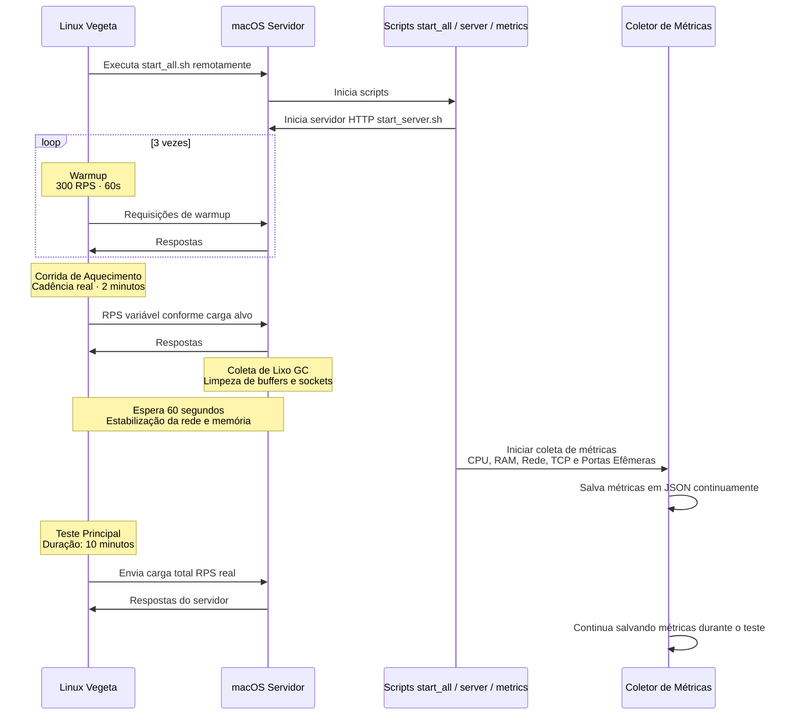

# 📚 TCC - Trabalho de Conclusão de Curso

> **Análise de Desempenho em Java: Threads Tradicionais vs. Threads Virtuais**  
> **Autora:** Stephanye Cristine Antunes De Cunto  
> **Orientadora:** Me. Bianca Portes de Castro  
> **Coorientador:** Dr. José Rui Castro de Sousa  
> **Ano:** 2025

[](https://www.oracle.com/java/)
[](https://spring.io/projects/spring-boot)
[](https://maven.apache.org/)
[]()
[](https://github.com/tsenart/vegeta)
[](https://www.abntex.net.br/)
[]()
[](https://wakatime.com/badge/user/5a343522-23db-45ae-b20b-54655c392390/project/221c0cf4-099d-4775-8ef9-bb8e514e04b0)
[](LICENSE)

---

## 📑 Sumário

- [📋 Sobre o Projeto](#-sobre-o-projeto)
- [⚙️ Requisitos](#️-requisitos-mínimos)
- [🛠️ Stack Tecnológica](#️-stack-tecnológica)
- [☁️ Sincronização com Google Drive](#️-sincronização-automática-com-google-drive)
- [🏗️ Arquitetura](#️-arquitetura-do-projeto)
- [📁 Estrutura do Repositório](#-estrutura-do-repositório)
- [🚀 Início Rápido](#-como-começar)
- [📊 API de Benchmark](#-api-de-benchmark)
- [📦 Instalação de Dependências](#-pré-requisitos)
- [📝 Trabalhando com LaTeX](#-compilando-o-documento)
- [📚 Gerenciamento de Referências](#-gerenciando-referências)
- [🛠️ Ferramentas Recomendadas](#️-ferramentas-recomendadas)
- [🧪 Metodologia](#-metodologia-de-testes)
- [🐛 Solução de Problemas](#-problemas-comuns)
- [📚 Recursos e Links Úteis](#-recursos-úteis)
- [📋 Checklist de Progresso](#-checklist-de-progresso)
- [🎯 Próximos Passos](#-próximos-passos-2-semanas)
- [📧 Contato](#-contato)
- [📄 Licença](#-licença)
---

## 📋 Sobre o Projeto

Este repositório contém o desenvolvimento do Trabalho de Conclusão de Curso (TCC), que investiga as diferenças de desempenho entre **threads tradicionais** (gerenciadas pelo sistema operacional) e **threads virtuais** (gerenciadas pela JVM, introduzidas no Java 19).

### 🎯 Objetivos

- Comparar o desempenho entre threads tradicionais e virtuais em diferentes cenários
- Analisar o consumo de recursos (CPU, memória, I/O)
- Avaliar a escalabilidade sob diferentes cargas de trabalho
- Medir latência e throughput em aplicações web

### 📊 Status Atual

- ✅ Revisão bibliográfica em andamento
- ✅ Ambiente de desenvolvimento configurado (VM Azure)
- ✅ Servidor de benchmark implementado (Spring Boot)
- ✅ Definição da metodologia em andamento
- ✅ Configuração de ferramentas de teste (JMeter, VisualVM)
- 🔄 Implementação dos benchmarks (em andamento)
- 🔄 Coleta de dados (pendente)
- ⏳ Análise de resultados (pendente)

## ⚙️ Requisitos Mínimos

| Componente | Versão Mínima | Recomendado |
|------------|---------------|-------------|
| **Java** | 19+ (Virtual Threads) | 21 LTS |
| **Maven** | 3.8+ | 3.9+ |
| **Spring Boot** | 3.0+ | 3.2+ |
| **LaTeX** | TeX Live 2022+ | TeX Live 2024+ |
| **Sistema** | Ubuntu 20.04+ / macOS 12+ | Ubuntu 22.04 / macOS 14+ |
| **RAM** | 4 GB | 8 GB+ |
| **CPU** | 2 cores | 4+ cores |

> **⚠️ Importante:** Java 19+ é obrigatório para Virtual Threads (JEP 444).

---

## 🛠️ Stack Tecnológica

**Backend & Runtime:**  
[](https://www.oracle.com/java/)
[](https://spring.io/projects/spring-boot)
[](https://maven.apache.org/)

**Infraestrutura:**  
[]()
[](https://ubuntu.com/)

**Ferramentas de Teste:**  
[](https://github.com/tsenart/vegeta)
[](https://visualvm.github.io/)

**Documentação:**  
[](https://www.abntex.net.br/)

**DevOps:**  
[](https://github.com/StephanyeCunto/tcc)
[](https://rclone.org/)
[](https://drive.google.com/)

**Status:**  
[]()
[](https://wakatime.com/badge/user/5a343522-23db-45ae-b20b-54655c392390/project/221c0cf4-099d-4775-8ef9-bb8e514e04b0)
[](https://github.com/StephanyeCunto/tcc)

## ☁️ Sincronização Automática com Google Drive

Este repositório sincroniza automaticamente com o Google Drive após cada commit usando **Rclone** e **Git Hooks**, mantendo um backup sempre atualizado do projeto.

### Como Funciona

A sincronização ocorre através de um **hook post-commit** que executa o Rclone após cada commit. O processo filtra arquivos temporários (`.aux`, `.log`, `.git/`, etc.) definidos em `filters.txt` e envia apenas os arquivos relevantes para o Drive.


### Configuração Rápida

**1. Instalar Rclone:**
```bash
# Linux/macOS
curl https://rclone.org/install.sh | sudo bash

# Windows (Chocolatey)
choco install rclone
```

**2. Configurar Google Drive:**
```bash
rclone config
# n (new) → nome: drive → tipo: drive → autorize no navegador
```

**3. Criar Hook e Filtros:**
```bash
# Criar hook post-commit
cat > .git/hooks/post-commit << 'EOF'
#!/bin/bash

GREEN='\033[0;32m'
BLUE='\033[0;34m'
YELLOW='\033[1;33m'
RED='\033[0;31m'
NC='\033[0m'

REPO_DIR="$(cd "$(git rev-parse --show-toplevel)" && pwd)"
FILTER_FILE="$REPO_DIR/filters.txt"
DRIVE_PATH="drive:/tcc"
LOG_FILE="$REPO_DIR/.rclone-sync.log"
TIMESTAMP=$(date '+%Y-%m-%d %H:%M:%S')

echo -e "${BLUE}╔════════════════════════════════════════╗${NC}"
echo -e "${BLUE}║  🔄 Sincronizando com Google Drive    ║${NC}"
echo -e "${BLUE}╚════════════════════════════════════════╝${NC}"

rclone sync "$REPO_DIR" "$DRIVE_PATH" \
  --filter-from "$FILTER_FILE" \
  --delete-excluded \
  --log-file "$LOG_FILE" \
  --log-level INFO \
  --stats 1s \
  --stats-one-line

if [ $? -eq 0 ]; then
    echo -e "${GREEN}✅ Sincronização concluída!${NC}"
    echo "[$TIMESTAMP] ✅ Sync successful" >> "$LOG_FILE"
    BYTES=$(rclone size "$DRIVE_PATH" --json | jq -r '.bytes')
    SIZE=$(awk -v b="$BYTES" 'function human(x){s="B KB MB GB TB";split(s,a);for(i=1;x>=1024&&i<length(a);i++)x/=1024;return sprintf("%.2f %s",x,a[i])}END{print human(b)}')
    echo -e "${YELLOW}📊 Tamanho total no Drive: $SIZE${NC}"
else
    echo -e "${RED}⚠️  Erro na sincronização!${NC}"
    echo "[$TIMESTAMP] ❌ Sync failed" >> "$LOG_FILE"
    exit 1
fi

echo ""

EOF

chmod +x .git/hooks/post-commit

# Criar arquivo de filtros
cat > filters.txt << 'EOF'
# LaTeX Temporários
- *.aux
- *.bbl
- *.blg
- *.log
- *.out
- *.synctex.gz
- *.toc
- *.lof
- *.lot

# Sistema e Build
- .DS_Store
- Thumbs.db
- target/
- */target/
- build/

# Git e IDEs
- .git/
- .github/
- .gitignore
- .idea/
- .vscode/
- *.iml
EOF

# Adicionar ao .gitignore
echo -e "\n.rclone-sync.log\nfilters.txt" >> .gitignore
```

**Teste:** Execute `git commit --allow-empty -m "Teste sync"` para verificar a sincronização.

### Comandos Úteis

```bash
# Listar arquivos no Drive
rclone ls drive:/tcc

# Ver estrutura de pastas
rclone tree drive:/tcc

# Sincronização manual
rclone sync ./ drive:/tcc --filter-from ./filters.txt --progress

# Monitorar logs
tail -f .rclone-sync.log
```

### Solução de Problemas

| Problema | Solução |
|----------|---------|
| Hook não executa | `chmod +x .git/hooks/post-commit` |
| Erro de autenticação | `rclone config reconnect drive:` |
| Sync lento | Adicione `--transfers 8` ao comando rclone |

**⚠️ Importante:** O `rclone sync` é unidirecional (local → Drive). Para sincronização bidirecional, use `rclone bisync`.

---

## 🏗️ Arquitetura do Projeto

### Ambiente de Execução

## Carga constante




---

## 📁 Estrutura do Repositório

```
tcc/
├── Modelo_TCC_2025/                     # 📄 Documento principal (LaTeX)
│   ├── principal.tex                    # Arquivo principal do TCC
│   ├── principal.pdf                    # PDF compilado
│   ├── teste.tex                        # Documento auxiliar
│   ├── imagens/                         # Figuras e diagramas
│   │   └── Figura 1.png
│   ├── abntex2*.{cls,sty,bst,bib}       # Classes, estilos e templates ABNT
│
├── Proposta/                            # 📝 Versão da proposta
│   ├── Proposta_TCC/                    # Proposta oficial
│   │   ├── main.tex
│   │   ├── main.pdf
│   │   └── Resumo_Bianca_Primeira_Reunião.pdf
│   └── Proposta_Teste/                  # Proposta do teste a ser realizado
│       ├── TrabalhosRelacionadosTeste.tex
│       ├── Descrição_Teste.tex
│       ├── Tabela_comparativa.tex
│       └── *.pdf
│
├── Teste/                               # 🧪 Scripts de teste de carga
│   ├── Script/
│   │   ├── loadConstant/                # Carga constante
│   │   │   ├── benchmark_threads.sh
│   │   │   ├── benchmark_threads_local.sh
│   │   │   └── results/
│   │   │       └── threads/
│   │   │           ├── traditional/{1,3,5,7,9}
│   │   │           └── virtual/{2,4,6,8,10}
│   │   └── loadRamping/                 # Carga crescente
│   │       ├── benchmark_threads.sh
│   │       ├── benchmark_threads_local.sh
│   │       └── results/
│   │           ├── threads/
│   │           │   ├── traditional/{1,3,5,7,9}
│   │           │   └── virtual/{2,4,6,8,10}
│   │           └── view/                # Interface HTML dos resultados
│   │               ├── all.json
│   │               └── index.html
│   │
│   └── Serve_Test/                      # 🚀 Servidor Spring Boot para benchmarks
│       ├── benchmark-server/            # Projeto Maven
│       │   ├── pom.xml
│       │   └── src/
│       │       ├── main/java/com/benchmark/server/
│       │       │   ├── BenchmarkServerApplication.java
│       │       │   └── controller/ThreadBenchmarkController.java
│       │       └── resources/
│       │           ├── application.properties
│       │           ├── static/
│       │           └── templates/
│       └── benchmark-server.zip         # Arquivo compactado
│
├── Testando_maquina/                    # 🖥️ Scripts de monitoramento
│   ├── monitor.sh                       # CPU/RAM/IO
│   ├── tcp_monitor.sh                   # Portas efêmeras e TCP
│   └── teste.sh                         # Scripts gerais de teste
│
├── Trabalhos_Relacionados/              # 📚 Base teórica
│   ├── Quadro_Trabalhos_Relacionados/   # Tabela comparativa
│   │   ├── quadro.tex
│   │   └── quadro.pdf
│   ├── Resumo_Trabalhos_Relacionados/   # Resumos individuais
│   │   ├── Resumo_Trabalho_Do_HIARLY.tex
│   │   └── Resumo_Trabalho_Do_Vishesh.tex
│   └── Trabalhos_Relacionados/          # PDFs originais
│       ├── Avaliação_mecanismos_concorrência_Java8.pdf
│       ├── Benchmarking_Virtual_Threads.pdf
│       ├── Comparison_Concurrency_Java.pdf
│       ├── Tradução_Comparison_Concurrency_Java.pdf
│       └── Analise_Comparativa_Threads_GreenThreads.pdf
│
├── README.md                            # 📘 Documento raiz
└── filters.txt                           # 🚫 Regras de exclusão (Rclone)

```

---

## 🚀 Como Começar

### 1. Clone o Repositório

```bash
git clone https://github.com/StephanyeCunto/tcc
cd tcc
```

### 2. Configuração do Ambiente

#### Servidor de Benchmark (VM Azure)

```bash
cd Test/Serve_Test/benchmark-server

# Compilar o projeto
mvn clean package

# Executar o servidor
java -jar target/benchmark-server-0.0.1-SNAPSHOT.jar
```

O servidor estará disponível em: `http://<IP_DA_VM>:8080`

**VisualVM:**
```bash
# Linux/macOS
brew install visualvm  # ou baixe de https://visualvm.github.io/

# Conectar à VM via JMX
# Adicione ao servidor: -Dcom.sun.management.jmxremote.port=9090
```

### 3. Compilação do Documento LaTeX

```bash
cd Modelo_TCC_2025
latexmk -lualatex -pvc principal.tex
```
---

## 📊 API de Benchmark

| Endpoint | Método | Descrição | Exemplo de Uso |
|----------|--------|-----------|----------------|
| `/threads/virtual` | GET | Cria thread virtual (sleep 100ms) | `curl http://localhost:8080/threads/virtual` |
| `/threads/traditional` | GET | Cria thread tradicional (sleep 100ms) | `curl http://localhost:8080/threads/traditional` |
| `/threads/get` | GET | Retorna e reseta contador | `curl http://localhost:8080/threads/get` |
| `/threads/gc` | GET | Força Garbage Collection | `curl http://localhost:8080/threads/gc` |

**Resposta padrão:**
```json
{
  "message": "Thread virtual iniciada! Veja o console do servidor.",
  "counter": 42
}
```

**Comportamento Interno:**
- Cria thread usando `Thread.ofVirtual()` ou `new Thread()`
- Executa `Thread.sleep(100)` para simular I/O
- Incrementa contador atômico
- Aguarda conclusão com `join()`
---

## 📦 Pré-requisitos

### Para o Servidor

- **Java:** 19+ (com suporte a Virtual Threads)
- **Maven:** 3.8+
- **Spring Boot:** 3.x
- **Sistema:** Linux (Ubuntu/Debian recomendado)

**Instalação no Ubuntu:**

```bash
# Java 21 (LTS com Virtual Threads)
sudo apt update
sudo apt install openjdk-21-jdk

# Maven
sudo apt install maven

# Ferramentas de monitoramento
sudo apt install sysstat  # mpstat, iostat, vmstat
```

---

### Para Cliente de Testes (Máquina Local)


**Linux (Ubuntu/Debian):**
```bash
sudo apt update
sudo apt install default-jdk
sudo apt install visualvm

curl -L https://github.com/tsenart/vegeta/releases/download/v12.8.4/vegeta-12.8.4-linux-amd64.tar.gz -o vegeta.tar.gz
tar -xzf vegeta.tar.gz
sudo mv vegeta /usr/local/bin/
```

**macOS:**
```bash
# Instalar Java
brew install openjdk

# Instalar VisualVM
brew install --cask visualvm

# Instalar Vegeta
brew install vegeta
```

**Windows:**
- VisualVM: https://visualvm.github.io/  
- Vegeta: https://github.com/tsenart/vegeta/releases

---

### Para LaTeX

**Linux (Ubuntu/Debian):**
```bash
sudo apt-get update
sudo apt-get install texlive-full latexmk biber
```

**macOS:**
```bash
brew install --cask mactex
```

**Windows:**
- [MiKTeX](https://miktex.org/download) ou [TeX Live](https://www.tug.org/texlive/)
- Ou use [Overleaf](https://www.overleaf.com/) (editor online)

---

## 📝 Compilando o Documento

### Método 1: Compilação Automática (Recomendado)

```bash
cd Modelo_TCC_2025
latexmk -lualatex -pvc principal.tex
```

**Flags úteis:**
- `-pvc`: Recompila automaticamente ao salvar
- `-lualatex`: Usa LuaLaTeX (melhor suporte a UTF-8 e português)

### Método 2: Compilação Manual Completa

Para garantir que referências e citações sejam processadas corretamente:

```bash
cd Modelo_TCC_2025

# 1ª compilação - Gera arquivos auxiliares
lualatex principal.tex

# Processa referências bibliográficas
bibtex principal

# 2ª compilação - Inclui referências
lualatex principal.tex

# 3ª compilação - Ajusta referências cruzadas
lualatex principal.tex
```

### Método 3: Usando latexmk Simplificado

```bash
cd Modelo_TCC_2025
latexmk -lualatex -bibtex principal.tex
```

💡 O arquivo `principal.pdf` será gerado automaticamente.

### Limpeza de Arquivos Temporários

```bash
# Remove arquivos auxiliares (mantém PDF)
latexmk -c

# Remove TODOS os arquivos gerados (inclusive PDF)
latexmk -C
```

---

## 📚 Gerenciando Referências

### Arquivo de Bibliografia

As referências ficam em `abntex2-modelo-references.bib`. 

**Exemplos de diferentes tipos de entrada:**

**Artigo:**
```bibtex
@article{sobrenome2025,
  author  = {Nome Sobrenome},
  title   = {Título do Artigo},
  journal = {Nome da Revista},
  year    = {2025},
  volume  = {1},
  number  = {1},
  pages   = {1--10}
}
```

**Livro:**
```bibtex
@book{autor2024,
  author    = {Autor da Silva},
  title     = {Título do Livro},
  publisher = {Editora},
  year      = {2024},
  address   = {São Paulo}
}
```

**Site:**
```bibtex
@online{site2025,
  author = {Organização},
  title  = {Título da Página},
  year   = {2025},
  url    = {https://exemplo.com},
  urlaccessdate = {05 nov. 2025}
}
```

### Citando no Texto

**Citação direta (Autor faz parte da frase):**
```latex
Segundo \citeonline{sobrenome2025}, os resultados demonstram...
```
→ *Segundo Sobrenome (2025), os resultados demonstram...*

**Citação indireta (Autor entre parênteses):**
```latex
Os resultados demonstram \cite{sobrenome2025}...
```
→ *Os resultados demonstram (SOBRENOME, 2025)...*

**Múltiplas citações:**
```latex
Diversos autores concordam \cite{autor2024,sobrenome2025,site2025}.
```
---

## 🛠️ Ferramentas Recomendadas

### Editores LaTeX

| Editor | Vantagens |
|--------|-----------|
| **[VS Code](https://code.visualstudio.com/)** + [LaTeX Workshop](https://marketplace.visualstudio.com/items?itemName=James-Yu.latex-workshop) | Leve, moderno, Git integrado |
| **[TeXstudio](https://www.texstudio.org/)** | Específico para LaTeX, muitos recursos |
| **[Overleaf](https://www.overleaf.com/)** | Online, colaborativo, sem instalação |

---

## 🧪 Metodologia de Testes

### Fluxo de Experimentos
```
1. Preparação do Ambiente
   ├─ Configurar servidor (Linux/macOS) com limites ajustados
   │    ├─ Aumentar portas efêmeras
   │    ├─ Ajustar fs.file-max e somaxconn
   │    └─ Aumentar ulimit (files/threads)
   ├─ Ajustar rede
   │    ├─ Verificar gargalos de WiFi vs cabo
   │    └─ Testar throughput máximo real com curl/speedtest
   └─ Preparar aplicação
        ├─ Habilitar GC logs
        ├─ Configurar pool de threads
        └─ Iniciar servidor em modo de produção

2. Baseline (Sem Carga)
   ├─ Verificar uso de CPU, RAM e GC
   ├─ Verificar número de portas efêmeras em uso
   ├─ Validar latência local (curl)
   └─ Registrar estado do sistema com script JSON contínuo

3. Testes de Carga (Vegeta)
   ├─ Cenário 1: Baixa carga
   │    └─ 100 req/s por 30s para validar estabilidade
   ├─ Cenário 2: Carga média
   │    └─ 500 req/s por 1 min (latência + portas efêmeras)
   ├─ Cenário 3: Alto volume
   │    └─ 1500 req/s por 2 min (testa fila TCP e GC)
   ├─ Cenário 4: Limite do servidor
   │    └─ Aumentar req/s progressivamente até saturar CPU ou portas
   └─ Registrar:
         ├─ mean, p90, p95, p99, max
         ├─ status codes
         └─ throughput real recebido

4. Monitoramento (VisualVM + Scripts)
   ├─ Monitorar:
   │    ├─ CPU por thread
   │    ├─ Heap/Non-Heap
   │    ├─ Frequência e duração de GC
   │    ├─ Threads vivas
   │    ├─ Deadlocks
   │    └─ File descriptors
   ├─ Coleta contínua em JSON:
   │    ├─ /proc/sys/net/... (portas, conexões)
   │    ├─ uso de memória
   │    ├─ load average
   │    └─ conexões ESTABLISHED / TIME_WAIT / CLOSE_WAIT
   └─ Detectar:
         ├─ Gargalo de rede
         ├─ Exaustão de portas efêmeras
         └─ Saturação de threads

5. Análise Final
   ├─ Identificar quando o servidor saturou
   │    ├─ CPU 100%
   │    ├─ limitação de WiFi/cabo
   │    ├─ fila TCP cheia (somaxconn)
   │    └─ erro por falta de portas
   ├─ Comparar conexões WiFi vs cabo
   ├─ Comparar latências reais com GC ativo
   ├─ Criar gráficos:
   │    ├─ Latência (p50, p90, p99)
   │    ├─ Throughput
   │    ├─ GC pauses
   │    ├─ Threads vivas
   │    └─ Portas efêmeras em uso
   └─ Gerar conclusão sobre:
         ├─ Capacidade máxima segura do servidor
         ├─ Pontos de gargalo
         └─ Recomendações de otimização
```

### Variáveis Mensuradas

| Variável | Ferramenta | Unidade |
|----------|-----------|---------|
| **Throughput** |Vegeta | req/s |
| **Latência** | Vegeta | ms |
| **CPU** | VisualVM | % |
| **Memória Heap** | VisualVM | MB |
| **Threads Ativas** | VisualVM | count |
| **GC Pause** | VisualVM | ms |

---

## 🐛 Problemas Comuns

### LaTeX

| Problema | Solução |
|----------|---------|
| **Referências não aparecem** | Execute: `lualatex → bibtex → lualatex → lualatex` |
| **Acentos incorretos** | Use LuaLaTeX ao invés de pdfLaTeX |
| **Erro em imagens** | Verifique o caminho e se o arquivo existe em `imagens/` |
| **Undefined control sequence** | Verifique se todos os pacotes necessários estão instalados |
| **Compilação muito lenta** | Use `latexmk -c` para limpar arquivos temporários |

### Servidor e Testes

| Problema | Solução |
|----------|---------|
| **Servidor não inicia** | Verifique se a porta 8080 está livre: `lsof -i :8080` |
| **JMeter não conecta** | Confirme IP da VM e firewall (porta 8080 aberta) |
| **VisualVM não conecta** | Verifique configuração JMX e porta 9090 |
| **Métricas não coletadas** | Execute scripts com `sudo` e instale `sysstat` |
| **OutOfMemoryError** | Aumente heap: `-Xmx4g -Xms2g` |

---

# 📚 Recursos Úteis

## LaTeX e ABNT
- [📘 Documentação abntex2](https://www.abntex.net.br/) - Guia oficial do padrão ABNT para LaTeX
- [📖 Overleaf Learn LaTeX](https://www.overleaf.com/learn) - Tutoriais interativos e exemplos práticos
- [📚 LaTeX Wikibook](https://en.wikibooks.org/wiki/LaTeX) - Referência completa da linguagem

---

## Java e Concorrência
- [📄 JEP 444: Virtual Threads](https://openjdk.org/jeps/444) - Especificação oficial das Virtual Threads
- [🔬 JMH Samples](https://hg.openjdk.org/code-tools/jmh/file/tip/jmh-samples/) - Exemplos práticos de benchmarks
- [📕 Java Concurrency in Practice](https://jcip.net/) - Livro referência sobre concorrência
- [🧵 Project Loom](https://openjdk.org/projects/loom/) - Projeto que introduziu Virtual Threads
- [📚 Java Documentation](https://docs.oracle.com/en/java/) - Documentação oficial da Oracle
- [🎓 Baeldung Java](https://www.baeldung.com/) - Tutoriais e guias sobre Java

---

## Ferramentas de Teste e Monitoramento
- [Vegeta] https://github.com/tsenart/vegeta  
- [Vegeta Manual](https://github.com/tsenart/vegeta#usage)
- [📊 VisualVM Documentation](https://visualvm.github.io/documentation.html) - Guia de monitoramento e profiling
- [🌱 Spring Boot Reference](https://docs.spring.io/spring-boot/docs/current/reference/html/) - Documentação do Spring Boot
- [🔧 Maven Documentation](https://maven.apache.org/guides/) - Guias de build e gerenciamento de dependências

---

## Sincronização e Backup
- [📘 Rclone Documentation](https://rclone.org/docs/) - Documentação oficial do Rclone
- [☁️ Google Drive with Rclone](https://rclone.org/drive/) - Guia específico para Google Drive
- [🎯 Rclone Filtering](https://rclone.org/filtering/) - Como filtrar arquivos na sincronização
- [🔄 Rclone Commands](https://rclone.org/commands/) - Referência completa de comandos

---

## Controle de Versão
- [🐙 Git Documentation](https://git-scm.com/doc) - Documentação oficial do Git
- [🪝 Git Hooks Documentation](https://git-scm.com/docs/githooks) - Guia sobre hooks do Git
- [📖 Pro Git Book](https://git-scm.com/book/en/v2) - Livro gratuito sobre Git
- [🎓 GitHub Guides](https://guides.github.com/) - Tutoriais do GitHub

---

## Comunidades e Fóruns
- [💬 Stack Overflow - LaTeX](https://tex.stackexchange.com/) - Perguntas e respostas sobre LaTeX
- [💬 Stack Overflow - Java](https://stackoverflow.com/questions/tagged/java) - Comunidade Java
- [🤖 Reddit - r/LaTeX](https://www.reddit.com/r/LaTeX/) - Discussões sobre LaTeX
- [☕ Reddit - r/java](https://www.reddit.com/r/java/) - Comunidade Java no Reddit
- [🌐 Dev.to - Java](https://dev.to/t/java) - Artigos e tutoriais sobre Java

---

## 📋 Checklist de Progresso

### Documentação
- [x] README configurado
- [x] Estrutura organizada
- [x] Materiais de referência
- [x] Metodologia definida
- [ ] Seção de resultados preparada

### Ambiente
- [x] Servidor HTTP implementado
- [x] Vegeta instalado e configurado (Linux + macOS)
- [ ] VisualVM configurado (monitoramento local/remoto)
- [ ] Scripts de coleta testados (CPU, RAM, Rede, Portas Efêmeras, TCP)

### Implementação
- [x] Controller básico
- [x] Endpoints de benchmark (virtual, tradicional, contador e GC)
- [x] Coleta de métricas com scripts independentes
- [ ] Diferentes cenários de carga Vegeta implementados
- [ ] Logging estruturado (JSON + logs do servidor)
- [ ] Coleta automática contínua de métricas

### Testes
- [x] Baseline (sem carga)
- [ ] Warmups automatizados (3×60s, 300 RPS)
- [ ] Corrida de aquecimento (2 min, cadência real)
- [ ] Espera e estabilização (60s)
- [ ] Teste principal (10 minutos)
- [ ] Testes de rede (latência, jitter, perda)
- [ ] Testes comparativos: Wi-Fi vs Cabo, Linux vs macOS

### Análise
- [ ] Dados coletados consolidados
- [ ] Processamento de métricas (Python + JSON)
- [ ] Gráficos gerados (latência, throughput, CPU, RAM, portas efêmeras)
- [ ] Comparação virtual × tradicional
- [ ] Análise estatística
- [ ] Conclusões preliminares

### Escrita
- [x] Introdução
- [x] Revisão bibliográfica
- [ ] Metodologia
- [ ] Resultados
- [ ] Discussão
- [ ] Conclusão

---

## 🎯 Próximos Passos (2 Semanas)

## 📆 Semana 1 — Preparação + Execução dos Testes
### 🔧 Preparação do Ambiente
- [ ] Configurar Vegeta (Linux + macOS)
- [ ] Criar scripts de automação:
  - Warmups (3× 300 RPS · 60s)
  - Corrida de aquecimento (2 minutos)
  - Coleta de lixo (GC)
  - Estabilização (60s)
  - Coleta contínua de métricas
  - Teste principal (10 minutos)
- [ ] Validar coleta de métricas (CPU, RAM, rede, TCP, portas efêmeras)
- [ ] Confirmar comunicação entre as máquinas
- [ ] Verificar se o servidor está recebendo e respondendo corretamente

### 🚀 Execução Completa dos Testes
- [ ] Executar baseline (sem carga)
- [ ] Executar warmups (3 ciclos)
- [ ] Executar corrida de aquecimento (2 min)
- [ ] Executar GC + estabilização (60s)
- [ ] Iniciar coleta contínua de métricas
- [ ] Executar teste principal (10 min)
- [ ] Consolidar todos os logs e saídas JSON

---

## 📆 Semana 2 — Processamento + Análise + Documentação Final
### 📊 Processamento dos Dados
- [ ] Organizar métricas de CPU, RAM, rede, latência e RPS
- [ ] Limpar e padronizar arquivos JSON
- [ ] Gerar gráficos e tabelas comparativas
- [ ] Identificar gargalos e padrões

### 🧠 Análise e Escrita
- [ ] Escrever análise dos resultados
- [ ] Criar seção de metodologia final
- [ ] Documentar ambiente, ferramentas, scripts e parâmetros usados
- [ ] Revisar todo o texto e corrigir inconsistências

### 🎤 Finalização
- [ ] Preparar a apresentação final
- [ ] Criar gráficos visuais da arquitetura e fluxo dos testes
- [ ] Ajustes finais no documento

---

## 📧 Contato

**Stephanye Cristine Antunes De Cunto**

Para dúvidas sobre o projeto ou colaborações, entre em contato através do GitHub.

---

## 📄 Licença

Este trabalho é de natureza acadêmica e está disponível para fins educacionais.

⚠️ **Nota sobre Plágio:** Este material é protegido por direitos autorais. Citações e referências devem seguir as normas ABNT.

---

**📌 Última atualização:** Dezembro de 2025