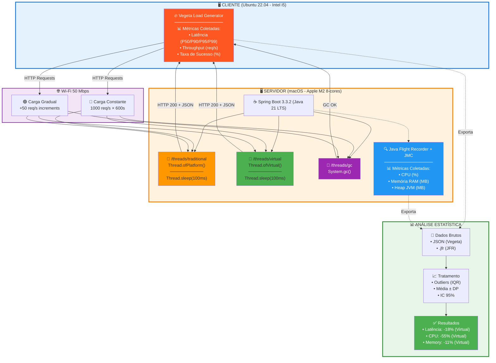

# 📚 TCC - Trabalho de Conclusão de Curso

> **Análise Comparativa entre Threads Tradicionais e Virtuais no Java**  
> **Autora:** Stephanye Cristine Antunes De Cunto  
> **Orientadora:** Me. Bianca Portes de Castro  
> **Coorientador:** Dr. José Rui Castro de Sousa  
> **Instituição:** Instituto Federal de Educação, Ciência e Tecnologia do Sudeste de Minas Gerais - Campus Rio Pomba  
> **Ano:** 2025

[](https://www.oracle.com/java/)
[](https://spring.io/projects/spring-boot)
[](https://maven.apache.org/)
[](https://github.com/tsenart/vegeta)
[](https://www.abntex.net.br/)
[]()
[](LICENSE)

---

## 📑 Sumário

- [📋 Sobre o Projeto](#-sobre-o-projeto)
- [🎯 Objetivos](#-objetivos)
- [🛠️ Stack Tecnológica](#️-stack-tecnológica)
- [📁 Estrutura do Repositório](#-estrutura-do-repositório)
- [📦 Instalação de Dependências](#-pré-requisitos)
- [🧪 Metodologia](#-metodologia)
- [📊 Principais Resultados](#-principais-resultados)
- [📝 Compilando o Documento](#-compilando-o-documento-latex)
- [📚 Recursos Úteis](#-recursos-úteis)
- [📧 Contato](#-contato)
- [📄 Licença](#-licença)

---

## 📋 Sobre o Projeto

Este repositório contém o Trabalho de Conclusão de Curso (TCC) do Bacharelado em Ciência da Computação, que investiga as diferenças de desempenho entre **threads tradicionais** (gerenciadas pelo sistema operacional) e **threads virtuais** (gerenciadas pela JVM, introduzidas no Java 19 através do Project Loom).

### 🔍 Contexto

As threads virtuais foram introduzidas no Java 19 como uma alternativa para contornar limitações das threads tradicionais relacionadas ao overhead de criação, consumo de memória e escalabilidade. Este trabalho avalia empiricamente como essa nova abordagem impacta o desempenho de aplicações concorrentes em cenários de operações I/O-bound.

### 📖 Fundamentação Teórica

O estudo se baseia nos seguintes conceitos fundamentais:

- **Threads Tradicionais (Modelo 1:1):** Cada thread de usuário é mapeada diretamente para uma thread do sistema operacional, resultando em maior consumo de memória (~1 MB por thread) e overhead de criação e troca de contexto.

- **Threads Virtuais (Modelo M:N):** Múltiplas threads virtuais são multiplexadas sobre um conjunto menor de carrier threads gerenciadas pela JVM, com pilhas dinâmicas (~1 KB inicial) e mecanismos de mounting/unmounting para operações bloqueantes.

- **Operações I/O-bound:** Cenários caracterizados por frequentes períodos de espera (ex: acesso a banco de dados, chamadas HTTP), onde threads virtuais são esperadas apresentar melhor aproveitamento de recursos.

---

## 🎯 Objetivos

**Objetivo Geral:**  
Analisar as diferenças de desempenho entre threads tradicionais e threads virtuais, avaliando como cada abordagem impacta a execução de aplicações concorrentes.

**Objetivos Específicos:**
- Compreender os fundamentos teóricos da programação concorrente e das diferentes abordagens de threads
- Medir e comparar métricas de desempenho (latência, throughput, uso de recursos)
- Analisar os resultados obtidos, identificando vantagens e limitações de cada modelo

---

## 🛠️ Stack Tecnológica

**Backend & Runtime:**  
[](https://www.oracle.com/java/)
[](https://spring.io/projects/spring-boot)
[](https://maven.apache.org/)

**Ambiente de Testes:**
- **Servidor:** macOS Tahoe 26.1, Apple M2 (8 núcleos), 8 GB RAM
- **Cliente:** Ubuntu 22.04 LTS, Intel Core i5-2410M, 8 GB RAM
- **Rede:** Wi-Fi 50 Mbps (ambas as máquinas)

**Ferramentas de Teste:**  
[](https://github.com/tsenart/vegeta)
[](https://docs.oracle.com/en/java/java-components/jdk-mission-control/)
[](https://www.oracle.com/java/technologies/jdk-mission-control.html)

---

## 📁 Estrutura do Repositório

```
TCC_Java_Thread_Benchmark/
├── Trabalho/                  # 📄 Versão final do TCC
├── Apresentacao/              # 📊 Slides da apresentação
├── Trabalhos_Relacionados/    # 📚 Artigos e referências
│
├── Teste/
│   ├── Script/                # ⚙️ Scripts de execução dos benchmarks
│   │   ├── loadConstant/
│   │   └── loadRamping/
│   │
│   └── Serve_Test/
│       └── benchmark-server/  # 🚀 Aplicação Spring Boot usada nos testes
│
└── README.md                  # 📘 Documentação do projeto
```

---

## 📦 Pré-requisitos

### Para Replicação dos Experimentos

Consulte o repositório de código: [TCC_Java_Thread_Benchmark](https://github.com/StephanyeCunto/TCC_Java_Thread_Benchmark)

**Requisitos Mínimos:**
- Java 19+ (obrigatório para Virtual Threads - JEP 444)
- Maven 3.8+
- Sistema operacional com suporte a alta concorrência (Linux/macOS recomendado)

---

## 🧪 Metodologia

### Arquitetura dos Experimentos


```mermaid
graph TB
    subgraph Cliente["🖥️ CLIENTE (Ubuntu 22.04 - Intel i5)"]
        VEG["🔥 Vegeta Load Generator<br/>────────────────<br/>📊 Métricas Coletadas:<br/>• Latência (P50/P90/P95/P99)<br/>• Throughput (req/s)<br/>• Taxa de Sucesso (%)"]
    end
    
    subgraph Rede["🌐 Wi-Fi 50 Mbps"]
        CARGA1["🔵 Carga Constante<br/>1000 req/s × 600s"]
        CARGA2["🟢 Carga Gradual<br/>+50 req/s increments"]
    end
    
    subgraph Servidor["🖥️ SERVIDOR (macOS - Apple M2 8-cores)"]
        SPRING["☕ Spring Boot 3.3.2 (Java 21 LTS)"]
        
        TRAD["📍 /threads/traditional<br/>Thread.ofPlatform()<br/>───────────<br/>Thread.sleep(100ms)"]
        VIRT["📍 /threads/virtual<br/>Thread.ofVirtual()<br/>───────────<br/>Thread.sleep(100ms)"]
        GC["📍 /threads/gc<br/>System.gc()"]
        
        MONITOR["🔍 Java Flight Recorder + JMC<br/>────────────────<br/>📊 Métricas Coletadas:<br/>• CPU (%)<br/>• Memória RAM (MB)<br/>• Heap JVM (MB)"]
        
        SPRING --> TRAD
        SPRING --> VIRT
        SPRING --> GC
        SPRING -.-> MONITOR
    end
    
    VEG -->|HTTP Requests| CARGA1
    VEG -->|HTTP Requests| CARGA2
    CARGA1 --> TRAD
    CARGA1 --> VIRT
    CARGA2 --> TRAD
    CARGA2 --> VIRT
    CARGA1 --> GC
    CARGA2 --> GC
    
    TRAD -->|HTTP 200 + JSON| VEG
    VIRT -->|HTTP 200 + JSON| VEG
    GC -->|GC OK| VEG
    
    subgraph Analise["📊 ANÁLISE ESTATÍSTICA"]
        DADOS["📁 Dados Brutos<br/>• JSON (Vegeta)<br/>• .jfr (JFR)"]
        STATS["📈 Tratamento<br/>• Outliers (IQR)<br/>• Média ± DP<br/>• IC 95%"]
        RESULT["✅ Resultados<br/>• Latência: -18% (Virtual)<br/>• CPU: -55% (Virtual)<br/>• Memory: -11% (Virtual)"]
        
        DADOS --> STATS --> RESULT
    end
    
    VEG -.->|Exporta| DADOS
    MONITOR -.->|Exporta| DADOS
    
    style Cliente fill:#e3f2fd,stroke:#1976d2,stroke-width:3px
    style Servidor fill:#fff3e0,stroke:#f57c00,stroke-width:3px
    style Rede fill:#f3e5f5,stroke:#7b1fa2,stroke-width:2px
    style Analise fill:#e8f5e9,stroke:#388e3c,stroke-width:3px
    style VEG fill:#ff5722,color:#fff
    style TRAD fill:#ff9800
    style VIRT fill:#4caf50
    style GC fill:#9c27b0,color:#fff
    style MONITOR fill:#2196f3,color:#fff
    style RESULT fill:#4caf50,color:#fff
```

### Cenários Avaliados

#### 1. Carga Constante (Estabilidade)
- **Objetivo:** Avaliar comportamento sob carga uniforme ao longo do tempo
- **Configuração:**
  - 3 ciclos de warmup (300 req/s × 60s)
  - Teste principal: 1000 req/s × 600s
  - 50 repetições por mecanismo (100 execuções totais)
- **Métricas:** Latência (média, P90, P95, P99), uso de CPU/memória/heap

#### 2. Carga Gradual - Ramp Up (Escalabilidade)
- **Objetivo:** Identificar limite máximo de requisições processáveis
- **Configuração:**
  - Incrementos de 50 req/s a cada iteração
  - Teste de 10s por nível de carga
  - Finalização após 3 falhas consecutivas
- **Métricas:** Taxa máxima de requisições (rate), utilização de recursos no ponto de saturação

### Simulação de Operações I/O
Cada endpoint utiliza `Thread.sleep(100 ms)` para simular operações I/O-bound típicas (ex: consultas a banco de dados, chamadas HTTP externas).

### Tratamento Estatístico
- **Remoção de Outliers:** Método dos quartis (IQR) com k=1,5
- **Métricas Analisadas:** Média, desvio padrão, percentis (P50, P90, P95, P99)
- **Intervalo de Confiança:** 95% (distribuição t de Student)

---

## 📊 Principais Resultados

### Cenário 1: Carga Constante

| Métrica | Threads Virtuais | Threads Tradicionais | Diferença |
|---------|-----------------|---------------------|-----------|
| **Latência Média** | 0,1438 s | 0,1762 s | **-18,4%** ✅ |
| **P99 Latência** | 1,0600 s | 1,9432 s | **-45,4%** ✅ |
| **CPU (%)** | 3,70 ± 0,11 | 8,26 ± 0,10 | **-55,2%** ✅ |
| **Memória (MB)** | 410,72 ± 149,33 | 462,22 ± 124,54 | **-11,1%** ✅ |
| **Heap (MB)** | 142,24 ± 86,77 | 179,63 ± 73,73 | **-20,8%** ✅ |
| **Throughput** | 998-999 req/s | 998-999 req/s | Equivalente |
| **Taxa de Sucesso** | ~100% | ~100% | Equivalente |

**Conclusões:**
- ✅ Threads virtuais apresentaram **menor latência** em todos os percentis
- ✅ **Redução significativa de CPU** (55%), indicando maior eficiência
- ✅ **Menor consumo de memória e heap**, com maior variabilidade devido ao gerenciamento dinâmico de pilhas
- ⚖️ Throughput equivalente sob carga constante

### Cenário 2: Carga Gradual (Ramp Up)

| Métrica | Threads Virtuais | Threads Tradicionais | Diferença |
|---------|-----------------|---------------------|-----------|
| **Rate Máximo** | 2.072,14 ± 828,42 | 2.008,16 ± 940,78 | +3,2% |
| **CPU (%)** | 2,26 ± 0,73 | 3,95 ± 1,54 | **-42,8%** ✅ |
| **Memória (MB)** | 478,40 ± 0,07 | 479,08 ± 0,10 | -0,1% |
| **Heap (MB)** | 188,96 ± 43,32 | 195,34 ± 56,36 | -3,3% |

**Conclusões:**
- ⚖️ Throughput máximo **equivalente** (diferença não estatisticamente significativa)
- ✅ Threads virtuais mantêm **menor uso de CPU** mesmo sob estresse
- ⚖️ Consumo de memória e heap **convergem** próximo ao ponto de saturação
- 🔍 Gargalo observado: **limitações do sistema operacional** (portas efêmeras, somaxconn) mascararam benefícios do modelo de threading

### Síntese Comparativa

```
┌─────────────────────┬────────────────┬────────────────┬─────────────────┐
│     Aspecto         │  Carga Normal  │ Carga Extrema  │  Recomendação   │
├─────────────────────┼────────────────┼────────────────┼─────────────────┤
│ Latência            │ 🟢 Virtuais    │ 🟢 Virtuais    │ Sempre Virtuais │
│ Uso de CPU          │ 🟢 Virtuais    │ 🟢 Virtuais    │ Sempre Virtuais │
│ Uso de Memória      │ 🟢 Virtuais    │ 🟡 Equivalente │ Virtuais        │
│ Throughput Máximo   │ 🟡 Equivalente │ 🟡 Equivalente │ Qualquer        │
│ Estabilidade        │ 🟢 Virtuais    │ 🟢 Virtuais    │ Sempre Virtuais │
└─────────────────────┴────────────────┴────────────────┴─────────────────┘

Legenda: 🟢 = Vantagem Clara | 🟡 = Desempenho Equivalente
```

---

## 📚 Recursos Úteis

### Java e Concorrência
- [📄 JEP 444: Virtual Threads](https://openjdk.org/jeps/444) - Especificação oficial
- [🧵 Project Loom](https://openjdk.org/projects/loom/) - Projeto de origem
- [📕 Java Concurrency in Practice](https://jcip.net/) - Livro referência

### Trabalhos Relacionados Citados
1. **Pandita (2024)** - *Benchmarking the Performance of Java Virtual Threads in High-Throughput Workloads*
2. **Souto (2024)** - *Uma análise comparativa entre threads e green threads no Java*
3. **Gustafsson & Persson (2024)** - *Comparison of Concurrency Technologies in Java*
4. **Águas (2015)** - *Avaliação dos mecanismos de concorrência na API do Java 8*

---

## 📧 Contato

**Stephanye Cristine Antunes De Cunto**

Para dúvidas sobre o projeto ou colaborações, entre em contato através do GitHub.

---

## 📄 Licença

Este trabalho é de natureza acadêmica e está disponível para fins educacionais e de pesquisa.

⚠️ **Nota sobre Uso Acadêmico:** Este material é protegido por direitos autorais. Citações e referências devem seguir as normas ABNT. O plágio é uma violação ética grave e pode resultar em sanções acadêmicas.

**Como citar este trabalho:**
```
CUNTO, Stephanye Cristine Antunes De. Análise Comparativa entre Threads 
Tradicionais e Virtuais no Java. 2025. Trabalho de Conclusão de Curso 
(Bacharelado em Ciência da Computação) - Instituto Federal de Educação, 
Ciência e Tecnologia do Sudeste de Minas Gerais, Rio Pomba, 2025.
```

---

**📌 Última atualização:** Fevereiro de 2026